# End-to-End California Housing Price Prediction (PySpark ML Pipelines)

## 📌 Project Overview

This project demonstrates a production-grade, distributed machine learning pipeline built using **Apache Spark (PySpark)** to predict housing prices across California.

The pipeline simulates real-world enterprise architectures by treating data preprocessing, categorical encoding, feature scaling, and model inference as an atomic, unified workflow—preventing data leakage and ensuring seamless deployment readiness.

---

## 🚨 The Problem

Traditional machine learning code is often written as a series of disconnected scripts:

* They suffer from severe **data leakage** when scaling parameters are calculated outside cross-validation folds.
* They are brittle and break easily when moving from a Jupyter notebook into production data streams.
* They struggle to handle scale when data volumes surpass single-node memory capacities.

---

## 💡 The Solution

An automated, enterprise-ready machine learning framework that:

* Implements an isolated, multi-stage **PySpark ML Pipeline** (`PipelineModel`).
* Scales distributed feature transformations seamlessly across data clusters.
* Persists the entire trained transformation and inference engine natively to disk for zero-leakage production deployment.

---

## ⚙️ Tech Stack & Architecture

* **Engine:** Apache Spark / PySpark (Spark SQL & Spark ML)
* **Model:** Linear Regression with L2 Regularization (`regParam=0.001`)
* **Environment:** Python / Jupyter Notebook
* **Storage Layer:** Distributed Parquet format for stage metadata

---

## 🔄 Pipeline Architecture

1. **Ingestion & Processing:** Distributed processing of California housing datasets via Spark DataFrames.
2. **StringIndexer:** Converts categorical text features into numerical indices.
3. **OneHotEncoder:** Encodes indexing metrics into binary vectors.
4. **VectorAssembler:** Bundles raw and encoded numerical parameters into a single optimized feature vector.
5. **StandardScaler:** Normalizes variance scales to eliminate numerical dominance biases.
6. **LinearRegression Engine:** Executes distributed matrix training optimizations.

---

## 🔄 Pipeline Graphical Architecture

```mermaid
flowchart LR
    subgraph "📡 INGESTION"
        A[("📁 California Housing Data")]
    end

    subgraph "🔥 FEATURES"
        B["👁️ StringIndexer"]
        C["⚡ OneHotEncoder"]
        D["📦 VectorAssembler"]
    end

    subgraph "⚖️ SCALING"
        E["⚖️ StandardScaler"]
    end

    subgraph "🎯 INFERENCE ENGINE"
        F["🤖 Linear Regression"]
    end

    subgraph "💾 OUTPUT"
        G[("📥 Saved PipelineModel")]
    end

    A --> B --> C --> D --> E --> F --> G

    style A fill:#FF9900,stroke:#232F3E,stroke-width:2px,color:#000
    style B fill:#9370DB,stroke:#6A0DAD,stroke-width:2px,color:#fff
    style C fill:#9370DB,stroke:#6A0DAD,stroke-width:2px,color:#fff
    style D fill:#9370DB,stroke:#6A0DAD,stroke-width:2px,color:#fff
    style E fill:#0174CE,stroke:#0056A3,stroke-width:2px,color:#fff
    style F fill:#FF4F8B,stroke:#99002E,stroke-width:2px,color:#fff
    style G fill:#28A745,stroke:#1E6F2F,stroke-width:2px,color:#fff
```

## 🧠 Key Technical Achievements & Metrics

The production model was rigorously audited using multiple evaluation metrics to ensure a reliable balance between baseline predictive precision and protection against high-outlier variances:

* **Mean Absolute Error (MAE):** $50,597.34 (Average baseline prediction variation)
* **Root Mean Squared Error (RMSE):** $69,825.72 (Outlier-sensitive penalty tracking metric)
* **R-squared ($R^2$):** 63.08% of the total variance in California housing prices explained.

---

## ✅ Production Packaging

* **Atomic Serialization:** The complete sequence of data transformations and model parameters is serialized together into a native Spark `PipelineModel`.
* **Zero Ingress Leakage:** Production scoring scripts can load the artifact using a single line of code, entirely eliminating manual feature duplication errors during stream transformations.

---

## 🚀 Future Improvements

* Integrate the PySpark job directly into an automated **Apache Airflow** DAG orchestration schedule.
* Migrate local processing workloads onto an **AWS EMR Cluster** backed by an **Amazon S3 Data Lake**.
* Implement real-time monitoring and drift evaluation using **MLflow**.

---

## 👨‍💻 Author

**Data Engineer / Analyst** Building high-performance, scalable distributed systems and production data pipelines.
